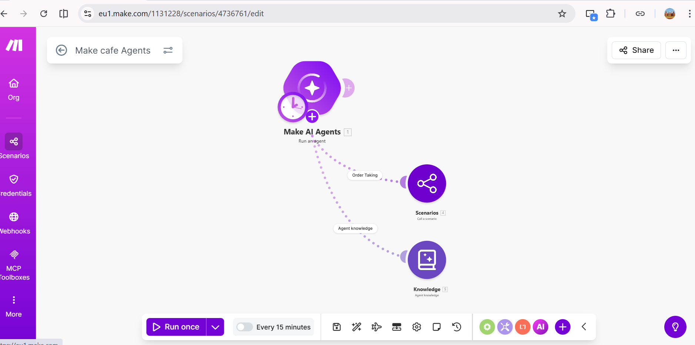
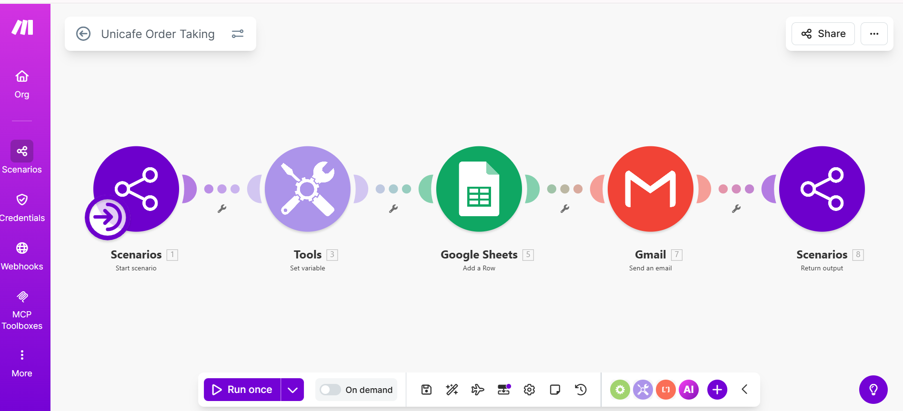

# UniCafe AI Telegram Order Bot

## Overview

A complete AI-driven Telegram chatbot for UniCafe built entirely on Make.com (no custom coding required).  
Customers chat naturally → AI handles queries or takes orders → Google Sheets + Email automation completes the flow.

## Key Features

- **Warm AI Assistant** – Friendly tone + strict “no hallucination” rules
- **Knowledge Base Tool** – Semantic search in uploaded documents (menu, policies, etc.)
- **Order Taking Tool** – Mandatory collection of Name, Email, Order Details & Address
- **Auto Order ID** – `ORD-YYYYMMDDHHMM-CustomerName`
- **Google Sheets Logging** – Real-time order record
- **Instant Confirmation Email** – Sent via Gmail with Order ID
- **Sub-scenario Architecture** – Clean, reusable, and scalable

## Project Blueprints (3 files)

1. **UniCafe.blueprint.json** → Main Telegram webhook + AI Agent (entry point)
2. **Order Taking.blueprint.json** → Sub-scenario that handles data collection, Sheets, Email & return confirmation
3. **cafe Agents.blueprint.json** → Advanced AI Agent with two tools (Order Taking + Knowledge Base)

## How It Works (Flow)

1. Customer messages @UniCafeBot on Telegram
2. `WatchUpdates` → `RunLocalAIAgent`
3. AI decides:
   - General query? → Answers from Knowledge Base
   - Wants to order? → Calls “Order Taking” tool
4. Sub-scenario collects data → Creates Order ID → Adds row to Google Sheet → Sends email → Returns confirmation
5. AI replies to user with final message

## Tech Stack (All Make.com native)

- Telegram Bot API
- Make AI Local Agent (supports Groq, OpenAI, Claude, Gemini, xAI etc.)
- Google Sheets + Gmail
- Scenario Service (sub-scenarios)
- Knowledge:StandAlone (semantic search)

## Setup Instructions

1. Import all 3 blueprints in Make.com
2. Connect your Telegram bot token
3. Connect Google account (Sheets + Gmail)
4. Upload menu/policy PDFs in the Knowledge tool
5. Set AI connection (recommended: Groq or xAI for speed)
6. Turn on the main scenario

## ScreenShot

## Future Ready

- Add payment link in confirmation
- Multi-language support
- WhatsApp/Instagram fallback
- Analytics dashboard
